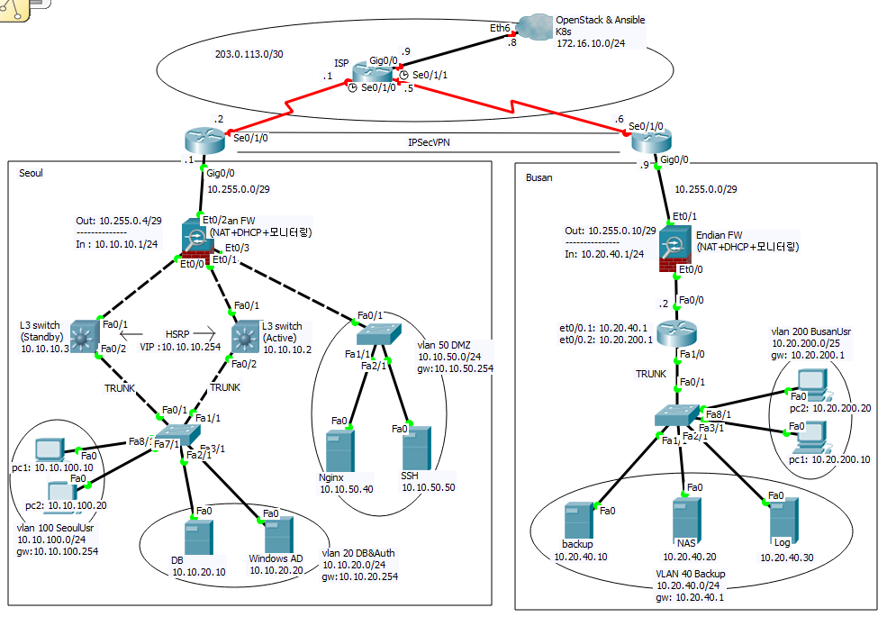

# infrastructure-portfolio-2026
네트워크, Linux 및 보안 실습 프로젝트를 정리한 포트폴리오입니다.

## Projects

### 1. Network Infrastructure Project

SSH, Backup, Log 서버를 구축하고  
서브넷 간 라우팅, 키 기반 접근 제어, 자동 백업, 중앙 로그 수집 환경을 구성했습니다.

## Network Architecture

### 2. Wireshark Network Analysis

Wireshark를 활용하여 DNS 및 TCP 통신 과정과  
네트워크 장애 상황을 분석했습니다.

### 3. Windows Event Log Analysis

SSID·USB 식별 정보·Defender 탐지 경로·백업 실패 원인을
이벤트 ID와 속성 값으로 확인하고 PowerShell로 데이터 추출했습니다.

## Portfolio

[PDF Portfolio](./portfolio.pdf)
